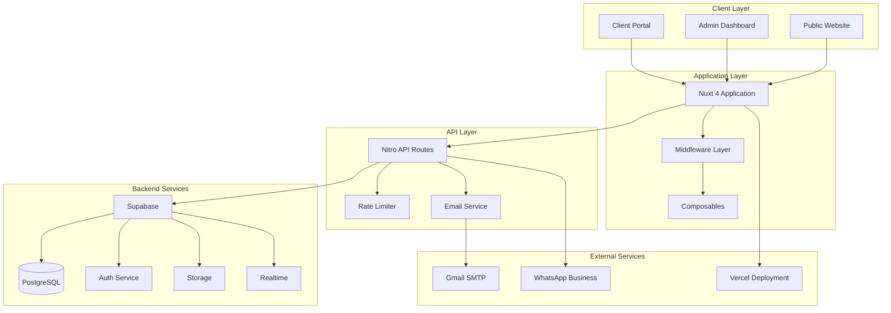
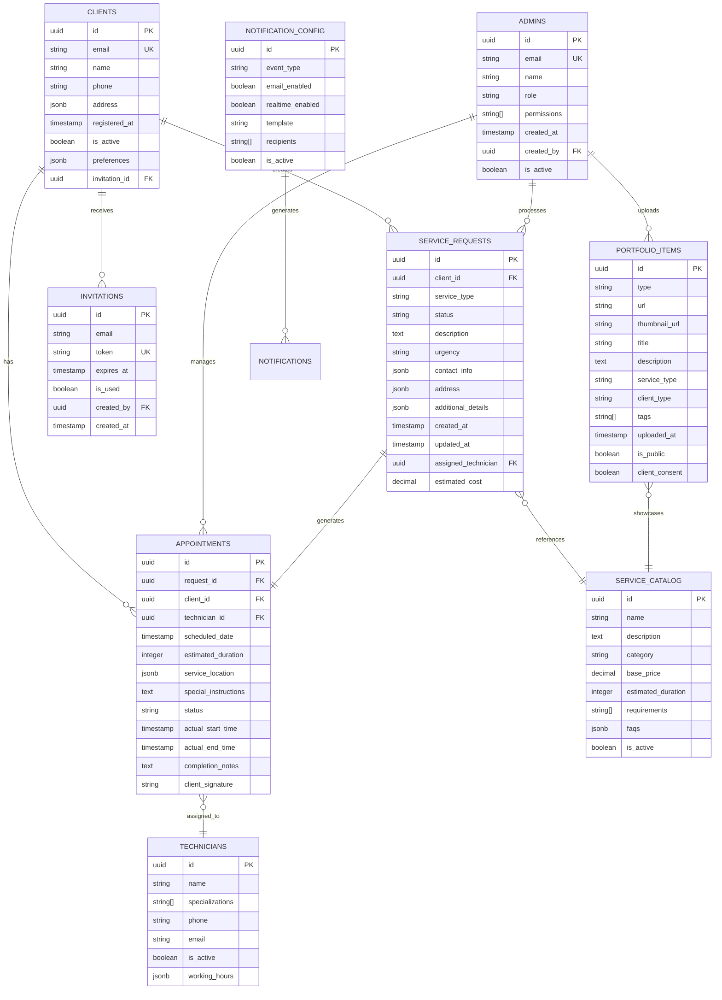

# Design Document - Nova Aliança Service Management System

## Overview

The Nova Aliança Service Management System is a comprehensive B2B platform built on Nuxt 4 with Vue 3, designed to manage the complete service lifecycle for an automation and security services company. The system employs a dual-portal architecture with role-based access control, real-time notifications, and seamless integration with Supabase for backend services.

The platform serves two primary user groups: registered clients who can request services and track their progress, and administrators who manage operations, approve requests, and coordinate scheduling. The system handles six core services: gate automation, security cameras, intercoms, photocells, electronic locks, and preventive maintenance.

## Architecture

### High-Level Architecture



### Technology Stack

- **Frontend Framework**: Nuxt 4 with Vue 3 and TypeScript
- **Styling**: Tailwind CSS with component utilities (clsx, tailwind-merge, class-variance-authority)
- **Backend**: Nitro server with API routes
- **Database**: Supabase (PostgreSQL with real-time subscriptions)
- **Authentication**: Supabase Auth with dual user types (clients/admins)
- **Storage**: Supabase Storage for portfolio media
- **Email**: Gmail SMTP via Nodemailer
- **Analytics**: Vercel Analytics
- **Testing**: Vitest framework
- **Deployment**: Vercel platform

## Components and Interfaces

### Core Components

#### Authentication System
```typescript
interface AuthenticationService {
  // Client authentication
  authenticateClient(email: string, password: string): Promise<ClientSession>
  registerClient(invitation: InvitationToken, userData: ClientData): Promise<ClientAccount>
  
  // Admin authentication
  authenticateAdmin(email: string, password: string): Promise<AdminSession>
  createAdmin(adminData: AdminData, role: AdminRole): Promise<AdminAccount>
  
  // Session management
  validateSession(token: string): Promise<SessionData>
  refreshSession(refreshToken: string): Promise<SessionData>
  terminateSession(sessionId: string): Promise<void>
}

interface SessionData {
  userId: string
  userType: 'client' | 'admin'
  role?: AdminRole
  permissions: Permission[]
  expiresAt: Date
}

type AdminRole = 'super_admin' | 'editor' | 'viewer'
type Permission = 'read_clients' | 'write_clients' | 'approve_requests' | 'manage_schedule' | 'manage_portfolio'
```

#### Service Request Management
```typescript
interface ServiceRequestManager {
  createRequest(clientId: string, serviceData: ServiceRequestData): Promise<ServiceRequest>
  updateRequestStatus(requestId: string, status: RequestStatus, adminId: string): Promise<ServiceRequest>
  getClientRequests(clientId: string, filters?: RequestFilters): Promise<ServiceRequest[]>
  getAdminRequests(adminId: string, filters?: RequestFilters): Promise<ServiceRequest[]>
  addRequestNote(requestId: string, note: string, adminId: string): Promise<RequestNote>
}

interface ServiceRequestData {
  serviceType: ServiceType
  description: string
  urgency: 'low' | 'medium' | 'high'
  preferredDate?: Date
  contactInfo: ContactInfo
  address: Address
  additionalDetails?: Record<string, any>
}

interface ServiceRequest {
  id: string
  clientId: string
  serviceType: ServiceType
  status: RequestStatus
  createdAt: Date
  updatedAt: Date
  assignedTechnician?: string
  estimatedCost?: number
  notes: RequestNote[]
  attachments: Attachment[]
}

type ServiceType = 'gate_automation' | 'security_cameras' | 'intercoms' | 'photocells' | 'electronic_locks' | 'preventive_maintenance'
type RequestStatus = 'pending' | 'approved' | 'in_progress' | 'completed' | 'cancelled' | 'requires_info'
```

#### Scheduling System
```typescript
interface SchedulingSystem {
  createAppointment(requestId: string, appointmentData: AppointmentData): Promise<Appointment>
  updateAppointment(appointmentId: string, updates: Partial<AppointmentData>): Promise<Appointment>
  getClientSchedule(clientId: string, dateRange?: DateRange): Promise<Appointment[]>
  getTechnicianSchedule(technicianId: string, dateRange?: DateRange): Promise<Appointment[]>
  checkAvailability(technicianId: string, date: Date, duration: number): Promise<boolean>
  sendReminders(appointmentId: string): Promise<NotificationResult>
}

interface AppointmentData {
  requestId: string
  technicianId: string
  scheduledDate: Date
  estimatedDuration: number
  serviceLocation: Address
  specialInstructions?: string
}

interface Appointment {
  id: string
  requestId: string
  clientId: string
  technicianId: string
  scheduledDate: Date
  status: AppointmentStatus
  actualStartTime?: Date
  actualEndTime?: Date
  completionNotes?: string
  clientSignature?: string
}

type AppointmentStatus = 'scheduled' | 'confirmed' | 'in_progress' | 'completed' | 'cancelled' | 'rescheduled'
```

#### Notification Engine
```typescript
interface NotificationEngine {
  sendEmailNotification(notification: EmailNotification): Promise<NotificationResult>
  sendRealTimeNotification(notification: RealTimeNotification): Promise<NotificationResult>
  subscribeToUpdates(userId: string, eventTypes: EventType[]): Promise<Subscription>
  unsubscribeFromUpdates(subscriptionId: string): Promise<void>
  getNotificationHistory(userId: string, filters?: NotificationFilters): Promise<NotificationRecord[]>
}

interface EmailNotification {
  to: string[]
  subject: string
  template: EmailTemplate
  data: Record<string, any>
  priority: 'low' | 'normal' | 'high'
}

interface RealTimeNotification {
  userId: string
  type: NotificationType
  title: string
  message: string
  data?: Record<string, any>
  expiresAt?: Date
}

type EventType = 'request_created' | 'request_approved' | 'appointment_scheduled' | 'appointment_reminder' | 'status_updated'
type NotificationType = 'info' | 'success' | 'warning' | 'error'
```

#### Portfolio Manager
```typescript
interface PortfolioManager {
  uploadMedia(file: File, metadata: MediaMetadata): Promise<PortfolioItem>
  updateItem(itemId: string, updates: Partial<PortfolioItem>): Promise<PortfolioItem>
  deleteItem(itemId: string): Promise<void>
  getPortfolioItems(filters?: PortfolioFilters): Promise<PortfolioItem[]>
  categorizeItem(itemId: string, categories: string[]): Promise<PortfolioItem>
}

interface PortfolioItem {
  id: string
  type: 'image' | 'video'
  url: string
  thumbnailUrl?: string
  title: string
  description?: string
  serviceType: ServiceType
  clientType: 'residential' | 'commercial'
  tags: string[]
  uploadedAt: Date
  isPublic: boolean
  clientConsent: boolean
}

interface MediaMetadata {
  title: string
  description?: string
  serviceType: ServiceType
  clientType: 'residential' | 'commercial'
  tags: string[]
  isPublic: boolean
  clientConsent: boolean
}
```

### User Interface Components

#### Client Portal Components
- **ClientDashboard**: Overview of active requests and upcoming appointments
- **ServiceCatalog**: Browse and request available services
- **RequestTracker**: Monitor status of submitted requests
- **ScheduleViewer**: View upcoming appointments and history
- **ProfileManager**: Update contact information and preferences
- **InvoiceAccess**: View and download billing documents

#### Admin Dashboard Components
- **AdminDashboard**: System overview with key metrics and alerts
- **RequestManager**: Review, approve, and process service requests
- **ScheduleManager**: Coordinate appointments and technician assignments
- **ClientManager**: Manage client accounts and relationships
- **PortfolioManager**: Upload and organize work showcase content
- **SystemConfig**: Configure notifications, invitations, and system settings

## Data Models

### Core Entities

```typescript
// User Management
interface Client {
  id: string
  email: string
  name: string
  phone: string
  address: Address
  registeredAt: Date
  isActive: boolean
  preferences: ClientPreferences
  invitationId?: string
}

interface Admin {
  id: string
  email: string
  name: string
  role: AdminRole
  permissions: Permission[]
  createdAt: Date
  createdBy: string
  isActive: boolean
}

// Service Management
interface ServiceCatalogItem {
  id: string
  name: string
  description: string
  category: ServiceType
  basePrice: number
  estimatedDuration: number
  requirements: string[]
  faqs: FAQ[]
  isActive: boolean
}

// Scheduling and Appointments
interface Technician {
  id: string
  name: string
  specializations: ServiceType[]
  phone: string
  email: string
  isActive: boolean
  workingHours: WorkingHours
}

// System Configuration
interface NotificationConfig {
  id: string
  eventType: EventType
  emailEnabled: boolean
  realTimeEnabled: boolean
  template: string
  recipients: string[]
  isActive: boolean
}

interface SiteConfig {
  companyName: string
  contactEmail: string
  whatsappNumber: string
  businessHours: WorkingHours
  serviceAreas: string[]
  maintenanceMode: boolean
}

// Supporting Types
interface Address {
  street: string
  number: string
  complement?: string
  neighborhood: string
  city: string
  state: string
  zipCode: string
}

interface ContactInfo {
  primaryPhone: string
  secondaryPhone?: string
  email: string
  preferredContact: 'phone' | 'email' | 'whatsapp'
}

interface WorkingHours {
  monday: TimeSlot[]
  tuesday: TimeSlot[]
  wednesday: TimeSlot[]
  thursday: TimeSlot[]
  friday: TimeSlot[]
  saturday: TimeSlot[]
  sunday: TimeSlot[]
}

interface TimeSlot {
  start: string // HH:MM format
  end: string   // HH:MM format
}
```

### Database Schema Relationships

